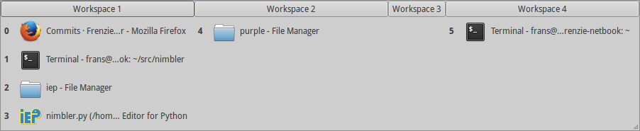

# Nimbler Documentation

Nimbler is a GTK-based window switcher. It can be activated with a hotkey, upon which it shows you a list of open windows ordered by workspace. You can switch quickly to the desired window using the shortcut displayed in front of the window. Workspaces can be activated using `F1` through `F12`. The list of windows also allows clicking and navigation with the arrow keys.

The program was forked from [Fuzzy Window Switcher](https://github.com/XCMer/fuzzy-window-switcher), which attempts to solve the same problem from a slightly different perspective. Instead of offering a static list, Fuzzy Windows Switcher only displays programs that match what you type.



To quit Nimbler, hit `Alt+F4`.

## Feature Enhancements & Bugs

If you have a suggestion or have found a bug, please use GitHub's issue tracker to report it.


## Installation

Nimbler has been tested on Debian and Ubuntu. However, it should work under any GTK-based environment.

### Requirements

Nimbler depends on GTK3+ and KeyBinder 3. You will need to install KeyBinder 3 via your operating system's package manager.

In case of Ubuntu, you can open the *Software Center* and search for `keybinder 3`, and then install it. (*Make sure you click on **show technical items** in the Software Center*)

If you're using Debian Jessie, you can similarly install libkeybinder. For Wheezy the package will have to be backported from Jessie or Ubuntu. More detailed instructions can be found below.

### Installing

For the actual installation procedure, check out this well-written blog post by [Andrew](https://github.com/hotice): [http://www.webupd8.org/2013/07/fuzzy-window-switcher-for-ubuntu.html](http://www.webupd8.org/2013/07/fuzzy-window-switcher-for-ubuntu.html)

I'll come up with an official set of instructions soon. Till then, the above blog post should serve as an excellent reference.


### Distro-Specific Instructions

Special instructions pertaining to specific distros would be mentioned here.


#### Debian Wheezy

Debian doesn't currently come with keybinder-3.0, so to backport you'll have to follow a slight variation on [the normal backporting procedure](http://wiki.debian.org/SimpleBackportCreation): Using Ubuntu 13.04 as the source instead of e.g. Debian testing or unstable.

```
# From http://packages.ubuntu.com/source/raring/keybinder-3.0
dget http://archive.ubuntu.com/ubuntu/pool/universe/k/keybinder-3.0/keybinder-3.0_0.3.0-0ubuntu1.dsc
dpkg-source -x keybinder-3.0_0.3.0-0ubuntu1.dsc 
cd keybinder-3.0-0.3.0/

# Here I typically add ~frenzie to my own packages.
debchange -R

# Check if you're missing something.
dpkg-checkbuilddeps

# I had to install these. You might need more.
sudo apt-get install libgirepository1.0-dev gobject-introspection

# And build the package.
dpkg-buildpackage -us -uc
cd ..

# We're done, install.
sudo dpkg -i *.deb

```

*- Thanks to [Frenzie](https://github.com/Frenzie) for these instructions*


## Configuration

Nimbler can be configured by creating a configuraton file in `~/.config/nimbler.conf`.

The configuration file, if present, should at least contain the following boilerplate.

```
[DEFAULT]

```

The following items can be configured:

### 1. Hotkey

The default hotkey is `F10`. However, if you want to change it, you can do it as follows:

```
[DEFAULT]
hotkey=F9
```

Or if you want to use the Control key, for example:

```
[DEFAULT]
hotkey=<Ctrl>w
```

Or the scroll lock:

```
[DEFAULT]
hotkey=Scroll_Lock
```

### 2. Ignored Window Titles

There may be some system-specific windows that you might not want to show up on the list of windows. You can specify this by specifying regexes of the window titles that should be ignored as follows:

```
[DEFAULT]
hotkey=F10
ignored_windows=
    ^unity-panel$
    ^unity-dash$
```

Notice how the list of windows are newline separated. If you want an exact match, enclose your title inside `^$`. Also, make sure you escape special characters in regexes.

### 3. Always Show Window Titles

Similar to ignored window titles, you can make some windows always show if they match the regexes you specify. This takes the higest precedence.

```
[DEFAULT]
hotkey=F10
always_show_windows=
    Sublime Text 2$
```

### 4. Show/Hide Specific Window Types

By default, Nimbler will show only normal windows. You can choose to ignore or display an entire type of window, like Dock, if you wish. Here's how you'd ignore all types of windows:

```
show_windows_normal=0
show_windows_desktop=0
show_windows_dock=0
show_windows_dialog=0
show_windows_toolbar=0
show_windows_menu=0
show_windows_utility=0
show_windows_splashscreen=0
```

If a window matches any regex of the `always_show_windows` option, then it will be shown regardless of whether the actual window type is ignored.

### 5. Icon Size

Normally Nimbler will use fairly large icons, which allows for quick identification of applications before switching attention to the window title. However, if you have a small screen, an awful lot of windows or simply don't like larger icons, you may opt for smaller icons. The available `icon_size` options are `default` (32x32px), `mini` (16x16px), and a custom size in pixels.

```
icon_size=mini
```

You can enter a number specifying the size in pixels if you want the icons to show up at a different size than the provided defaults.

```
icon_size=64
```

## Similar Software
If you're reading this, you're probably interested in other alternatives to the default application switchers. In no particular order, here are a few that might be of interest:

* [fuzzy-window-switcher](https://github.com/XCMer/fuzzy-window-switcher) is Nimbler's parent and it does what the name implies.
* [superswitcher](http://code.google.com/p/superswitcher/) is quite nice. However, it has been [discontinued](http://blogs.gnome.org/nigeltao/2013/01/28/so-long-and-thanks-for-the-super-switching/).
	* Because it hasn't been updated in a while, at least two minor forks exist: [smartswitcher](https://github.com/Frenzie/smartswitcher) and [switchy](https://github.com/cmpitg/switchy).
* [simpleswitcher](https://github.com/seanpringle/simpleswitcher) is a superswitcher fork that is far more similar to fuzzy-window-switcher than to superswitcher, except its matching is not fuzzy.
* [Rofi](https://davedavenport.github.io/rofi/) is a simpleswitcher fork that adds fuzzy matching, making it even more similar in nature to fuzzy-window-switcher. It also adds some extra features.

Spiritually, the main concept behind Nimbler itself is based on the Windows program [SmartTab.org](http://smarttab.org/).